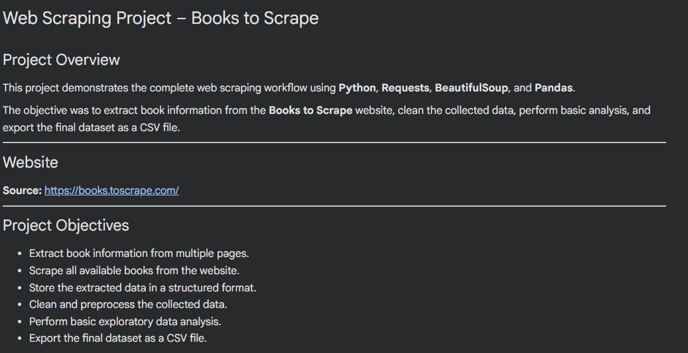
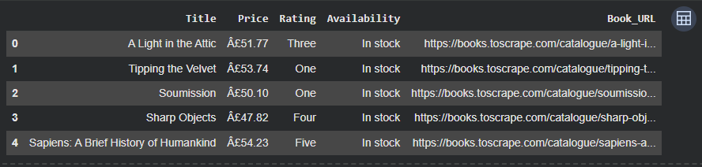
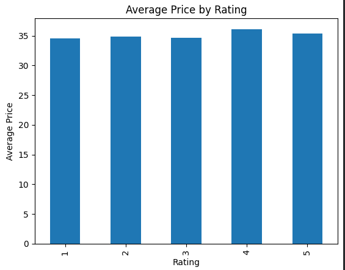
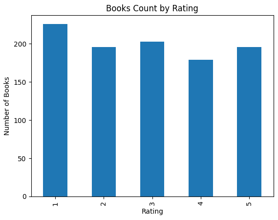
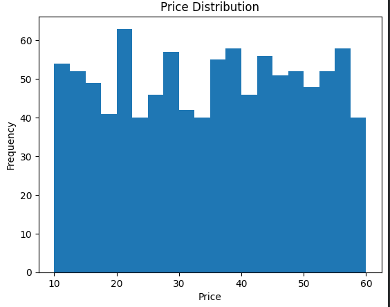
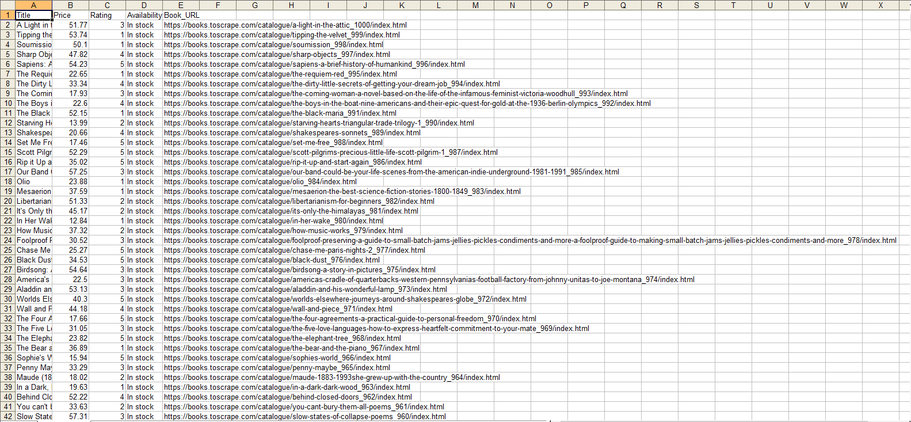

# 📚 Books to Scrape – Web Scraping & Data Analysis

## 📌 Project Overview

This project demonstrates an end-to-end web scraping workflow using **Python**, **Requests**, **BeautifulSoup**, and **Pandas**. The objective was to scrape book information from the **Books to Scrape** website, clean and analyze the extracted data, and export the final dataset into a CSV file.

A total of **1,000 book records** were successfully collected through multi-page scraping (pagination), processed, and analyzed.

---

## 🌐 Website

**Source:** https://books.toscrape.com/

---

## 🎯 Objectives

* Scrape book information from multiple web pages.
* Extract structured data from HTML.
* Handle website pagination.
* Clean and preprocess scraped data.
* Perform exploratory data analysis (EDA).
* Export the final dataset to CSV.

---

## 🛠️ Technologies Used

* Python
* Requests
* BeautifulSoup4
* Pandas
* Matplotlib
* lxml

---

## 📂 Dataset Information

The dataset contains **1,000 books** with the following attributes:

| Column       | Description                                   |
| ------------ | --------------------------------------------- |
| Title        | Name of the book                              |
| Price        | Price of the book                             |
| Rating       | Book rating (converted to numeric values 1–5) |
| Availability | Stock availability                            |
| Book_URL     | Direct URL of the book                        |

---

## 🔄 Project Workflow

### 1. Data Collection

* Sent HTTP requests using the Requests library.
* Parsed HTML pages using BeautifulSoup.
* Extracted required book information.
* Implemented pagination to scrape all 50 pages.
* Collected a total of 1,000 book records.

### 2. Data Cleaning

* Removed currency symbols from the Price column.
* Converted Price to numeric format.
* Converted Rating values from text (One–Five) to integers (1–5).
* Organized the cleaned data into a Pandas DataFrame.

### 3. Data Analysis

Performed basic exploratory analysis, including:

* Top 5 most expensive books
* Top 5 least expensive books
* Rating distribution
* Average price by rating
* Maximum price by rating
* Filtering and sorting operations

### 4. Data Export

* Exported the cleaned dataset to **books_data.csv**.

---

## 📊 Key Results

* ✅ Successfully scraped **1,000 books**
* ✅ Extracted data from **50 web pages**
* ✅ Cleaned and transformed the dataset
* ✅ Performed exploratory data analysis
* ✅ Exported the final dataset to CSV format

---

## 📁 Project Structure

```text
Books-to-Scrape-Web-Scraping/
│
├── README.md
├── requirements.txt
├── Web_Scraping_Books.ipynb
├── books_data.csv
│
└── screenshots/
    ├── about_page.png
    ├── dataframe_head.png
    ├── analysis_output.png
    └── csv_preview.png
```

---

## 📸 Project Screenshots

### About Page

### DataFrame Preview



### Analysis Output







### CSV Preview



---

## ▶️ How to Run

### 1. Clone the Repository

```bash
https://github.com/vikasdangi256/Books-to-Scrape-Web-Scraping
```

### 2. Install Dependencies

```bash
pip install -r requirements.txt
```

### 3. Run the Notebook

Open the notebook in **Google Colab** or **Jupyter Notebook** and execute all cells.

---

## 💡 Skills Demonstrated

* Web Scraping
* HTML Parsing
* Pagination Handling
* Data Cleaning
* Exploratory Data Analysis (EDA)
* Data Manipulation with Pandas
* CSV Export
* Python Programming

---

## 👨‍💻 Author

**Vikas Singh Thakur**

If you found this project useful, consider giving it a ⭐ on GitHub.
